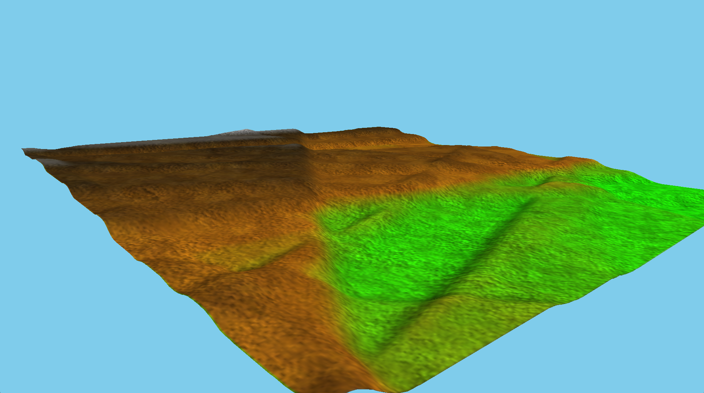
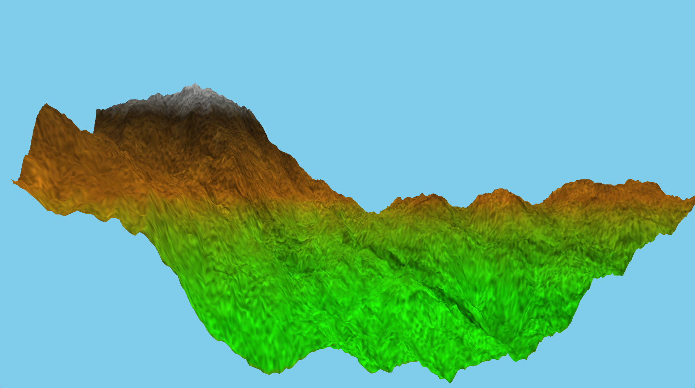
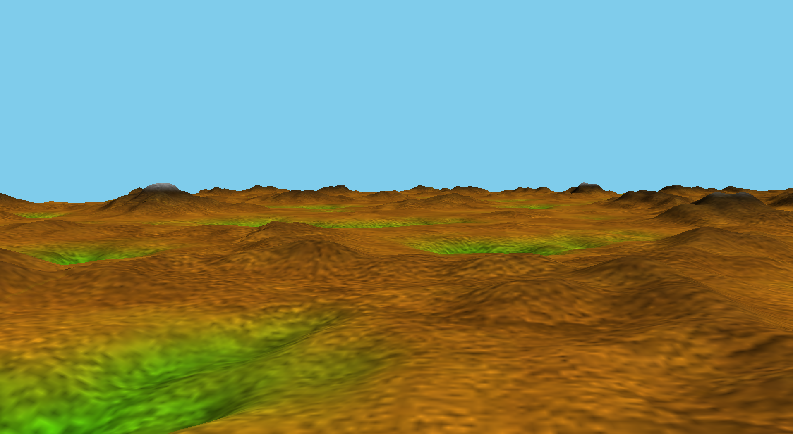
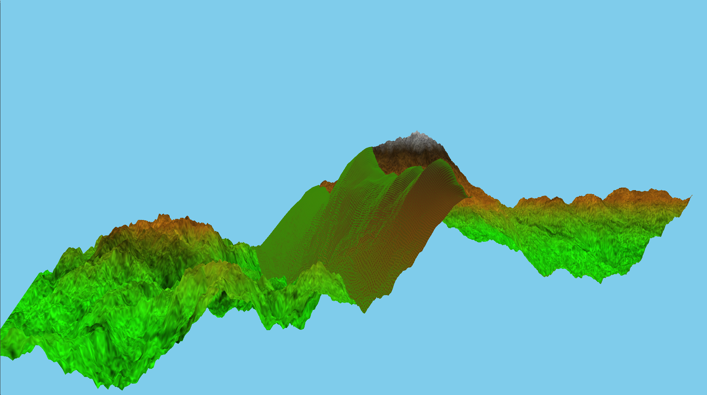

# Procedural Terrain Generation Using OpenGL

This project is an exploration of procedural terrain generation techniques using **C++** and **OpenGL**. It showcases multiple methods for generating, texturing, and lighting terrains, along with stitching and blending terrain chunks to ensure seamless transitions. 

## Features

### Terrain Generation Techniques
1. **Fault Formation**: A basic procedural technique used to create rugged terrain features.
2. **Midpoint Displacement**: A fractal algorithm to generate realistic terrain with smooth transitions.
3. **Perlin Noise (Layered)**: For continuous terrain generation, with multiple octaves layered for detailed landscapes.

### Texturing and Blending
- **Detail Maps**: Used to enhance terrain visuals with finer details.
- **Procedural Textures**: Textures are generated using a region-based system with tile blending to provide realistic and varied surfaces.

### Lighting Algorithms
- **Slope Lighting**: Determines terrain lighting based on surface slope for directional lighting effects.
- **Height-Based Lighting**: Adjusts terrain colors and light intensity based on elevation to emphasize height differences.

### Terrain Stitching and Seamless Transitions
- Implemented stitching and blending for terrains generated using midpoint displacement to ensure smooth transitions between adjacent terrain chunks.

---

## Work in Progress

- [x] **Terrain Generation Fault Formation**
- [x] **Terrain Generation - Midpoint Displacement** - Done
- [x] **Procedural Textures (Region System and Tile Blending)**
- [x] **Slope and Height-Based Lighting**
- [x] **Seamless Terrain Chunks**
- [ ] **Infinite Terrain Generation**

---

### Fault Formation

### Midpoint Displacement

### Continuous Terrain Using Perlin Noise

### Stitching

---

---

## Getting Started

### Prerequisites
- **C++17 or higher**
- **CMake**
- Compatible compiler (e.g., GCC, Clang, or MSVC)

#### All required libraries and dependencies are included and are configured using CMake

